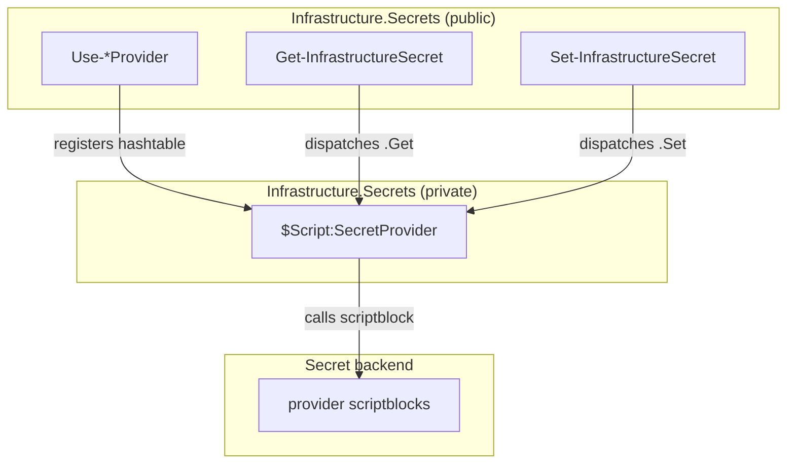
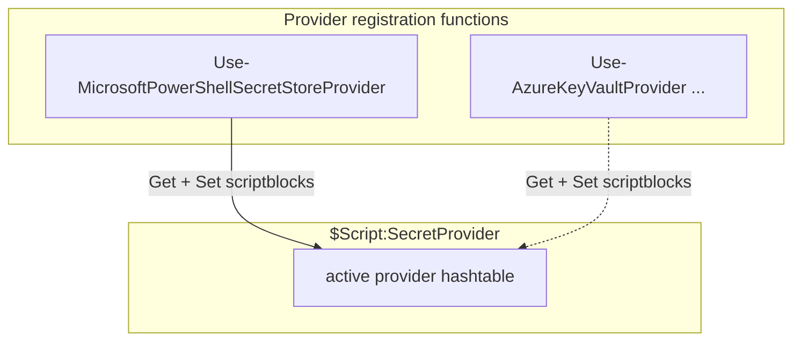
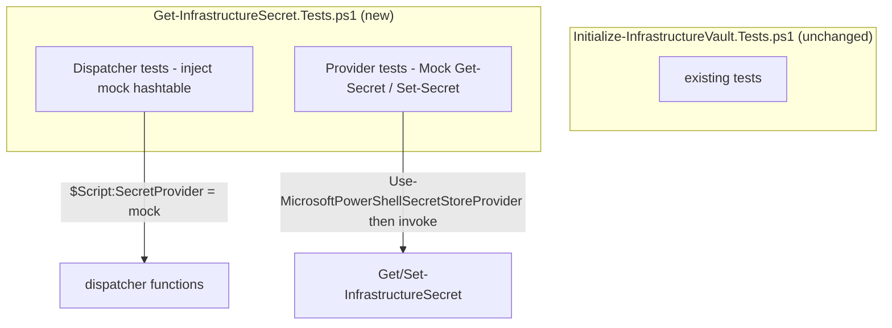

# Implementation Plan

## Index
- [Step 1 - Provider dispatch](#step-1---provider-dispatch)
- [Step 2 - MicrosoftPowerShellSecretStore provider](#step-2---microsoftpowershellsecretstore-provider)
- [Step 3 - Tests](#step-3---tests)

---

## Prerequisites

`Initialize-InfrastructureVault` already handles one-time vault setup.
These steps cover the runtime read/write path only.

---

## Step 1 - Provider dispatch

**What:** Module-level provider state and the two public functions that
dispatch to it.

A provider is a hashtable with two keys:

```powershell
@{
    Get = [scriptblock]   # param($VaultName, $SecretName) -> [string]
    Set = [scriptblock]   # param($VaultName, $SecretName, $Value) -> void
}
```

The module holds one active provider in `$Script:SecretProvider`. Public
functions dispatch through it:

```powershell
# Private state - one active provider per module session.
$Script:SecretProvider = $null

function Get-InfrastructureSecret {
    param(
        [Parameter(Mandatory)] [string] $VaultName,
        [Parameter(Mandatory)] [string] $SecretName
    )
    if (-not $Script:SecretProvider) {
        throw "No secret provider is active. Call Use-*Provider first."
    }
    & $Script:SecretProvider.Get $VaultName $SecretName
}

function Set-InfrastructureSecret {
    param(
        [Parameter(Mandatory)] [string] $VaultName,
        [Parameter(Mandatory)] [string] $SecretName,
        [Parameter(Mandatory)] [string] $Value
    )
    if (-not $Script:SecretProvider) {
        throw "No secret provider is active. Call Use-*Provider first."
    }
    & $Script:SecretProvider.Set $VaultName $SecretName $Value
}
```

Both functions propagate errors as terminating; consumers do not check
return values for null. Secret values are never written to any output
stream.

**Why:** Decouples the public interface from any specific backend.
Adding a new provider requires no changes to these functions — only a
new `Use-*Provider` registration function (Step 2 defines the first one).
The explicit "no provider active" error prevents silent null returns if a
consumer forgets to register a provider.



---

## Step 2 - MicrosoftPowerShellSecretStore provider

**What:** One public registration function that sets `$Script:SecretProvider`
to a hashtable backed by `Microsoft.PowerShell.SecretStore` — a
cross-platform PowerShell module that stores secrets in an encrypted local
file. On Windows it uses DPAPI, scoping the encrypted file to the current
Windows user account. It is not the Windows Credential Manager.

```powershell
function Use-MicrosoftPowerShellSecretStoreProvider {
    $Script:SecretProvider = @{
        Get = {
            param($VaultName, $SecretName)
            Get-Secret -Vault $VaultName -Name $SecretName `
                -AsPlainText -ErrorAction Stop
        }
        Set = {
            param($VaultName, $SecretName, $Value)
            Set-Secret -Vault $VaultName -Name $SecretName `
                -Secret $Value -ErrorAction Stop
        }
    }
}
```

A consumer script calls `Use-MicrosoftPowerShellSecretStoreProvider` once at startup before
any `Get-InfrastructureSecret` / `Set-InfrastructureSecret` calls.

Adding a new backend (e.g., Azure Key Vault) means adding a new
`Use-AzureKeyVaultProvider` function with its own scriptblock hashtable.
No existing code changes.

**Why:** Each provider is an isolated, named, independently testable unit.
Swapping backends is a change to which `Use-*Provider` is called — a
one-line change at the consumer's call site, not an edit inside a shared
function.



---

## Step 3 - Tests

### Existing tests - no changes required

`Initialize-InfrastructureVault.Tests.ps1` is unaffected. That function
handles vault *setup* and calls `Get-Secret`/`Set-Secret` directly for
its own round-trip verification — it does not use the provider abstraction
and has no reason to. Its stubs and mocks remain valid as-is.

### New test file

Add `Get-InfrastructureSecret.Tests.ps1` following the same structure as
the existing test file:

- **`BeforeAll`** — dot-source the three new function files; declare
  `function Get-Secret { param($Vault, $Name, [switch]$AsPlainText) }` and
  `function Set-Secret { param($Vault, $Name, $Secret) }` as stubs, same
  as the existing file. Pester requires a command to exist before it can
  be mocked.
- **`BeforeEach`** — reset `$Script:SecretProvider` to `$null` so each
  test starts with no active provider.

Test cases:

- `Get-InfrastructureSecret` — throws when `$Script:SecretProvider` is
  null; invokes `$Script:SecretProvider.Get` with the correct arguments
  when a mock provider hashtable is injected directly.
- `Set-InfrastructureSecret` — throws when `$Script:SecretProvider` is
  null; invokes `$Script:SecretProvider.Set` with the correct arguments
  when a mock provider hashtable is injected directly.
- `Use-MicrosoftPowerShellSecretStoreProvider` — after calling it, `Get-InfrastructureSecret`
  invokes `Get-Secret` with the expected `-Vault` and `-Name` arguments
  (verified via `Should -Invoke`); `Set-InfrastructureSecret` invokes
  `Set-Secret` with the expected arguments.

**Why:** Dispatcher tests inject a fake hashtable directly — they verify
routing logic without depending on any real backend. Provider tests verify
that `Use-MicrosoftPowerShellSecretStoreProvider` wires the correct cmdlets with the correct
arguments. Neither test set depends on the other. The stub pattern matches
the existing file so new contributors have one consistent model to follow.


