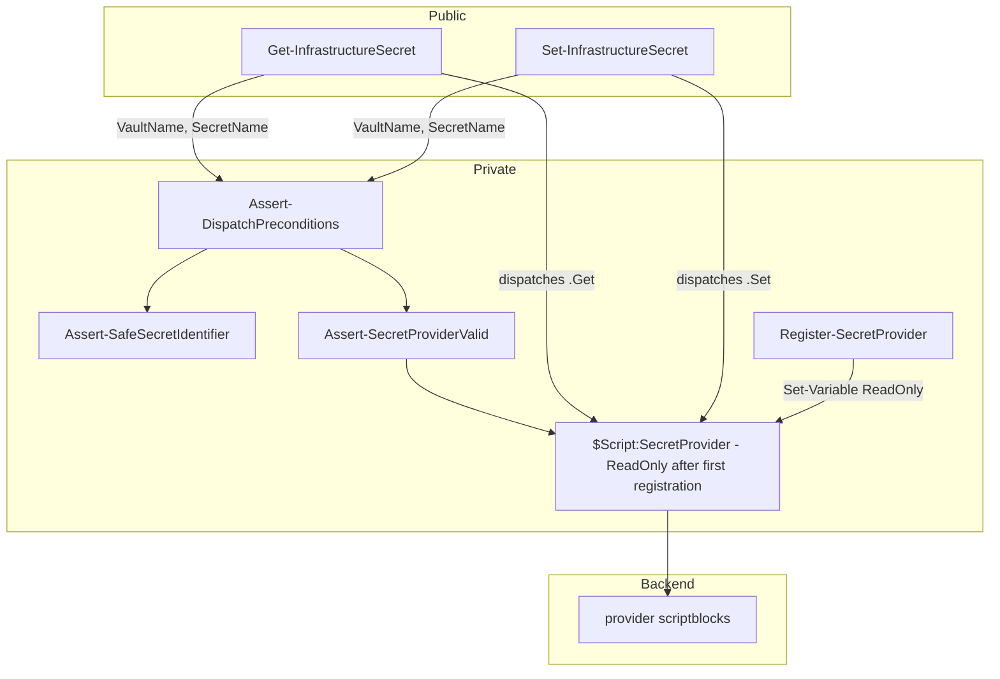
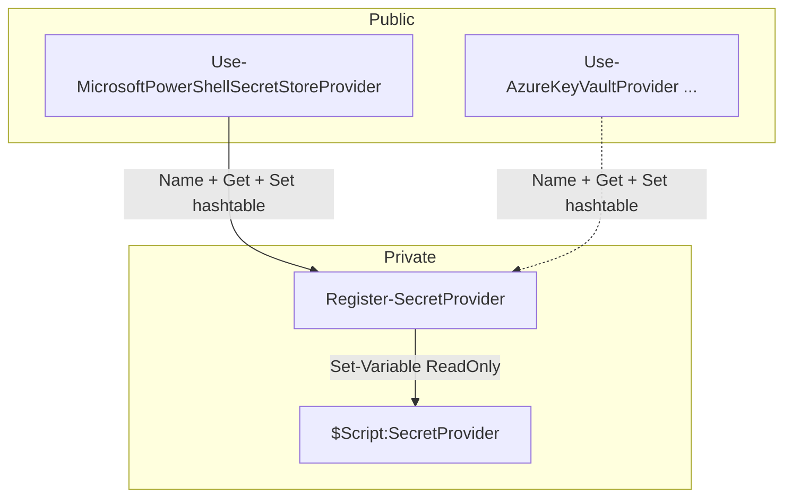
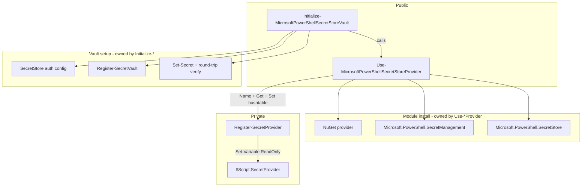

# Implementation Plan

## Index
- [Step 1 - Provider dispatch](#step-1---provider-dispatch)
- [Step 2 - MicrosoftPowerShellSecretStore provider](#step-2---microsoftpowershellsecretstore-provider)
- [Step 3 - Align vault setup with provider pattern](#step-3---align-vault-setup-with-provider-pattern)
- [Step 4 - Tests](#step-4---tests)

---

## Prerequisites

`Initialize-InfrastructureVault` handles one-time vault setup (see Step 3
for planned rename). These steps cover the runtime read/write path and the
alignment of vault setup naming with the provider pattern.

---

## Step 1 - Provider dispatch

**What:** Module-level provider state, private helpers, and the two public
dispatch functions. All files live under `Infrastructure.Secrets/`:

```
Private/
  Assert-SafeSecretIdentifier.ps1
  Assert-SecretProviderValid.ps1
  Assert-DispatchPreconditions.ps1
  Register-SecretProvider.ps1
Public/
  Get-InfrastructureSecret.ps1
  Set-InfrastructureSecret.ps1
```

### Provider shape

A provider is a hashtable with three mandatory keys:

```powershell
@{
    Name = [string]      # non-empty; used for idempotency and swap detection
    Get  = [scriptblock] # param($VaultName, $SecretName) -> [string]
    Set  = [scriptblock] # param($VaultName, $SecretName, $Value) -> void
}
```

`Name` is not an authenticity check — a caller with session access can
supply any string. It is an idempotency key and an accidental-swap guard.
Scriptblock authenticity cannot be verified in PowerShell; the trust
boundary is session access itself.

### Private helpers

**`Assert-SafeSecretIdentifier`** — validates that `$VaultName` and
`$SecretName` match `^[A-Za-z0-9_\-\.]+$`. Rejects unsafe characters
before they reach any provider, making injection impossible regardless of
how a provider handles the values internally. `$Value` is not validated —
secret content is arbitrary; providers must treat it as an opaque string.

**`Assert-SecretProviderValid`** — validates that `$Script:SecretProvider`
is a non-null hashtable with `Name` (non-empty string), `Get`
(ScriptBlock), and `Set` (ScriptBlock). Catches both the no-provider case
and any malformed value written directly to `$Script:SecretProvider`
outside of a `Use-*Provider` function.

**`Assert-DispatchPreconditions`** — calls both assertions above.
Extracted to avoid duplicating the same two calls in both dispatcher
functions.

**`Register-SecretProvider`** — validates the provider, enforces
idempotency and swap prevention, then stores it as ReadOnly:
- Same `Name` already registered: clears ReadOnly, re-registers
  (idempotent — safe to re-run setup scripts).
- Different `Name` already registered: throws with a reload instruction.
  Changing backends mid-session is not allowed; inconsistency between
  secrets read from two different stores is the risk.
- After storing: marks `$Script:SecretProvider` as `-Option ReadOnly` so
  normal assignment (`$Script:SecretProvider = ...`) fails immediately.
  `Set-Variable -Force` from inside the module scope still works — this
  is the remaining trust boundary.

### Public functions

Both dispatcher functions are intentionally thin:

```powershell
function Get-InfrastructureSecret {
    param([string]$VaultName, [string]$SecretName)
    Assert-DispatchPreconditions -VaultName $VaultName -SecretName $SecretName
    & $Script:SecretProvider.Get $VaultName $SecretName
}

function Set-InfrastructureSecret {
    param([string]$VaultName, [string]$SecretName, [string]$Value)
    Assert-DispatchPreconditions -VaultName $VaultName -SecretName $SecretName
    & $Script:SecretProvider.Set $VaultName $SecretName $Value
}
```

**Why:** All guard logic lives in named private helpers with their own
comments and test surface. The dispatchers stay readable; the helpers stay
independently testable.



---

## Step 2 - MicrosoftPowerShellSecretStore provider

**What:** One public registration function backed by
`Microsoft.PowerShell.SecretStore` — a cross-platform PowerShell module
that stores secrets in an encrypted local file. On Windows it uses DPAPI,
scoping the encrypted file to the current Windows user account. It is not
the Windows Credential Manager.

The function builds a provider hashtable and passes it to
`Register-SecretProvider`, which handles validation, ReadOnly enforcement,
and idempotency:

```powershell
function Use-MicrosoftPowerShellSecretStoreProvider {
    Register-SecretProvider -Provider @{
        Name = 'MicrosoftPowerShellSecretStore'
        Get  = {
            param($VaultName, $SecretName)
            Get-Secret -Vault $VaultName -Name $SecretName `
                -AsPlainText -ErrorAction Stop
        }
        Set  = {
            param($VaultName, $SecretName, $Value)
            Set-Secret -Vault $VaultName -Name $SecretName `
                -Secret $Value -ErrorAction Stop
        }
    }
}
```

A consumer script calls this once at startup before any
`Get-InfrastructureSecret` / `Set-InfrastructureSecret` calls.

Adding a new backend means adding a new `Use-*Provider` function that
calls `Register-SecretProvider` with its own hashtable. No other code
changes.

**Why:** `Register-SecretProvider` centralises all registration logic —
ReadOnly enforcement, idempotency, swap prevention — so each `Use-*Provider`
function is a thin constructor with no guard duplication.

**Provider contract for future implementations:** `$VaultName`,
`$SecretName`, and `$Value` must be passed to backend cmdlets or processes
via parameter binding, never via string interpolation or
`Invoke-Expression`. `$Value` in particular must be treated as an opaque
string and must never appear in a command argument list visible in
`ps aux` or equivalent.



---

## Step 3 - Align vault setup with provider pattern

**Why:** `Initialize-InfrastructureVault` is SecretStore-specific (installs
SecretManagement + SecretStore, configures SecretStore auth, registers a
vault, stores and verifies a secret). The generic name implies it works with
any backend, which is false and breaks the abstraction's promise. Two
changes fix this:

**Change 1 — Move module installation into
`Use-MicrosoftPowerShellSecretStoreProvider`.**
The function already owns "prepare and register the SecretStore backend";
ensuring the required modules are present is part of that. After this
change, calling `Use-MicrosoftPowerShellSecretStoreProvider` is sufficient
for a consumer that only needs runtime reads/writes on a machine where the
vault is already initialised — no vault-setup code runs.

Steps added before `Register-SecretProvider`:
1. Call `Invoke-ModuleInstall` (from `Infrastructure.Common`) for
   `Microsoft.PowerShell.SecretManagement`.
2. Call `Invoke-ModuleInstall` for `Microsoft.PowerShell.SecretStore`.

`Invoke-ModuleInstall` handles the install-if-absent check and import in
one call. The inline NuGet provider guard currently in
`Initialize-InfrastructureVault` is removed — NuGet is a prerequisite for
`Install-Module` and is handled by the consumer's bootstrap before any
module in this family is loaded.

`Infrastructure.Common` must be declared in `RequiredModules` in
`Infrastructure.Secrets.psd1` so `Invoke-ModuleInstall` is available
inside module function bodies without an explicit import at the call site.

**Change 2 — Rename `Initialize-InfrastructureVault` to
`Initialize-MicrosoftPowerShellSecretStoreVault`.**
The new name is parallel to `Use-MicrosoftPowerShellSecretStoreProvider`
and makes the backend coupling explicit. The function calls
`Use-MicrosoftPowerShellSecretStoreProvider` at the start so module
installation is not duplicated, then continues with SecretStore-specific
vault work: auth configuration, vault registration, secret storage, and
round-trip verification.

Files changed:
- `Public/Use-MicrosoftPowerShellSecretStoreProvider.ps1` — add two
  `Invoke-ModuleInstall` calls before `Register-SecretProvider`.
- Rename `Public/Initialize-InfrastructureVault.ps1` →
  `Public/Initialize-MicrosoftPowerShellSecretStoreVault.ps1`; remove
  NuGet guard and module install loop (now owned by `Use-*Provider`);
  call `Use-MicrosoftPowerShellSecretStoreProvider` at start.
- `Infrastructure.Secrets.psm1` — update dot-source path and export name.
- `Infrastructure.Secrets.psd1` — add `Infrastructure.Common` to
  `RequiredModules`; update `FunctionsToExport`; bump minor version.
- `README.md` — rename everywhere.



---

## Step 4 - Tests

### Structure

Test files mirror the production code layout. Each function has its own
file; unit tests mock the function's immediate dependencies only.

```
Tests/
  Private/
    Assert-SafeSecretIdentifier.Tests.ps1
    Assert-SecretProviderValid.Tests.ps1
    Assert-DispatchPreconditions.Tests.ps1
    Register-SecretProvider.Tests.ps1
  Public/
    Get-InfrastructureSecret.Tests.ps1
    Set-InfrastructureSecret.Tests.ps1
    Use-MicrosoftPowerShellSecretStoreProvider.Tests.ps1
    Initialize-MicrosoftPowerShellSecretStoreVault.Tests.ps1
  Integration/
    SecretStore-RoundTrip.Tests.ps1
```

### Provider state reset

All test files that register a provider dot-source the functions rather
than loading the installed module. This means all functions share the test
file's script scope. `$Script:SecretProvider` is reset in `BeforeEach`
with:

```powershell
Set-Variable -Name SecretProvider -Value $null -Option None -Scope Script -Force
```

`-Option None` clears the ReadOnly flag set by `Register-SecretProvider`
so the next test starts clean.

### Mocking principle

Each unit test file mocks the function's immediate dependencies and
asserts only what the function under test does — not what its
dependencies do. Dependency behaviour is covered by each dependency's own
test file.

Examples:
- `Assert-DispatchPreconditions.Tests.ps1` mocks `Assert-SafeSecretIdentifier`
  and `Assert-SecretProviderValid`; asserts each is called with the right args.
- `Register-SecretProvider.Tests.ps1` mocks `Assert-SecretProviderValid`;
  asserts it is called with the provider, then tests ReadOnly/idempotency/swap
  logic independently.
- `Get-InfrastructureSecret.Tests.ps1` mocks `Assert-DispatchPreconditions`;
  sets `$Script:SecretProvider` directly; asserts dispatch to `.Get`.

### Unit test cases

**`Assert-SafeSecretIdentifier`** — valid identifier (hyphens, dots,
underscores) passes; empty string throws (binding-level); semicolon, dollar
sign, and space each throw with the parameter name in the message.

**`Assert-SecretProviderValid`** — null throws; non-hashtable throws;
missing/blank `Name` throws; missing `Get`/`Set` throws; wrong type for
`Get`/`Set` throws; valid hashtable passes.

**`Assert-DispatchPreconditions`** — calls `Assert-SafeSecretIdentifier`
for `VaultName` and `SecretName` with correct arguments; calls
`Assert-SecretProviderValid` with `$Script:SecretProvider`.

**`Register-SecretProvider`** — calls `Assert-SecretProviderValid` with
the provider; first registration marks variable ReadOnly; re-registration
of the same name is idempotent and updates stored scriptblocks; different
name throws with reload instruction; direct assignment throws after
registration.

**`Get-InfrastructureSecret`** — calls `Assert-DispatchPreconditions` with
correct `VaultName`/`SecretName`; dispatches `.Get` with correct arguments;
returns the value from `.Get`.

**`Set-InfrastructureSecret`** — calls `Assert-DispatchPreconditions` with
correct `VaultName`/`SecretName`; dispatches `.Set` with correct arguments;
`$Value` with special characters is passed through unmodified.

**`Use-MicrosoftPowerShellSecretStoreProvider`** — calls
`Invoke-ModuleInstall` for `Microsoft.PowerShell.SecretManagement` and
`Microsoft.PowerShell.SecretStore`; calls `Register-SecretProvider` with
`Name = 'MicrosoftPowerShellSecretStore'`; registered `Get` scriptblock
calls `Get-Secret` with `-AsPlainText`; registered `Set` scriptblock calls
`Set-Secret` with correct arguments.

**`Initialize-MicrosoftPowerShellSecretStoreVault`** — see existing
comprehensive test contexts (config loading, validation, provider
registration, SecretStore auth config, vault registration, secret storage).

### Integration test

`SecretStore-RoundTrip.Tests.ps1` runs against a real SecretStore vault:

1. Installs `Microsoft.PowerShell.SecretManagement` and
   `Microsoft.PowerShell.SecretStore` if absent.
2. Skips gracefully if the store is configured with `Password` auth (to
   avoid resetting a developer's store).
3. Initialises the store with `Authentication=None` if not yet done
   (non-interactive; safe for CI).
4. Registers a dedicated integration test vault; tracks whether it was
   created so `AfterAll` only removes it if this run created it.
5. Asserts `Get-InfrastructureSecret` returns the exact value stored by
   `Set-InfrastructureSecret`.

Picked up automatically by `Run-Tests.ps1` (recurses `Tests\`). Runs on
`windows-latest` in GitHub Actions.
